<h1 align="center">HI! San Tin (សាន់ទីន)</h1>
<h3 align="center">Full Stack Developer | Software Engineering Student</h3>

  Phnom Penh, Cambodia &nbsp;|&nbsp; 3rd Year Software Engineering Student at Norton University

 

---

### About Me

I build full-stack applications across multiple frameworks and languages, working both independently and in team environments. I communicate fluently in both English and Khmer, and I'm currently deepening my skills in backend architecture, databases, and cloud deployment.

---

### Tech Stack

  

  

| Category | Technologies |
|---|---|
| **Frontend** | React, JavaScript, TypeScript, Blazor Server, HTML/CSS, TailwindCSS, Bootstrap |
| **Backend** | .NET (Blazor Server), PHP, Laravel |
| **Databases** | PostgreSQL, Oracle |
| **Tools** | Git, GitHub, Docker, Linux, VS Code |

---

### Featured Projects

| Project | Description |
|---|---|
| **Hotel Management System** | Full-stack booking platform with customer site and admin dashboard |
| **SwiftTrack** | Blazor Server/.NET parcel management system |
| **JamnehDoeng** | Bilingual bookstore with a React/PHP stack |
| **Laravel/Oracle Inventory System** | Inventory management backend |
| **MiniPOS** | VBA/Oracle 19c point-of-sale coursework project |

---

### GitHub Activity

  

---

### Connect

  

  

